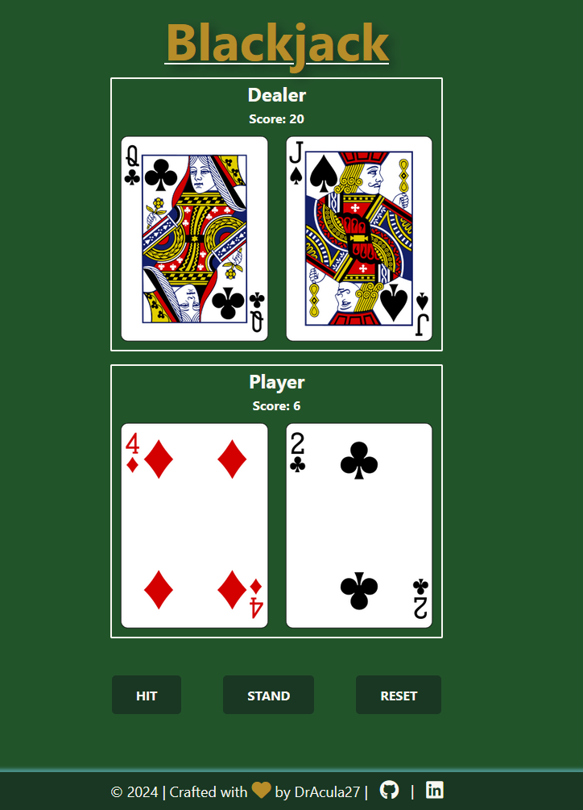

<!-- Improved compatibility of back to top link: See: https://github.com/othneildrew/Best-README-Template/pull/73 -->

<!-- PROJECT LOGO -->
 

  

  <h3 align="center">Blackjack</h3>

  

    Play blackjack - you versus the dealer!
     
    <a href="https://dracula27.github.io/blackjack/">View Demo</a>
  

<!-- TABLE OF CONTENTS -->

  
Table of Contents

  <ol>
    <li>
      <a href="#about-the-project">About The Project</a>
      <ul>
        <li><a href="#built-with">Built With</a></li>
      </ul>
    </li>
    <li><a href="#usage">Usage</a></li>
    <li><a href="#optimizations">Optimizations</a></li>
    <li><a href="#lessons-learned">Lessons Learned</a></li>
    <li><a href="#contact">Contact</a></li>
    <li><a href="#acknowledgments">Acknowledgments</a></li>
  </ol>

<!-- ABOUT THE PROJECT -->

## About The Project

    

The objective of Blackjack, also known as Twenty-One, is to beat the dealer by getting a hand value closer to 21 than the dealer's hand, without going over 21.

At the start of a blackjack game, the players and the dealer receive two cards each. The best possible blackjack hand is an opening deal of an ace with any ten-point card. This is called a "blackjack", or a natural 21, and the player holding this automatically wins unless the dealer also has a blackjack. If a player and the dealer each have a blackjack, the result is a tie (push).

If the dealer has a blackjack and the player does not, the player loses.

(<a href="#readme-top">back to top</a>)

### Built With

- 
- 
- 

(<a href="#readme-top">back to top</a>)

<!-- USAGE -->

## Usage

The basic rules of the game are:

1. **Player Turn.** After the cards have been dealt, the game goes on with the player taking action. The player can keep their hand as it is (stand) or take more cards from the deck (hit), one at a time, until either the player judges that the hand is strong enough to go up against the dealer's hand and stands, or until it goes over 21, in which case the player immediately loses (busts).
1. **Dealer Turn.** When the player has finished their actions, either decided to stand or busted, it is the dealer's turn. If the dealer has a natural 21 (blackjack) with their two cards, they won't take any more cards. The player loses, unless they also have a blackjack, in which case it is a tie (push). If the dealer doesn't have a natural blackjack, the dealer hits (takes more cards) or stands depending on the value of the hand. Contrary to the player, though, the dealer's action is completely dictated by the rules. The dealer must hit if the value of the hand is lower than 17, otherwise the dealer must stand.
1. **Winning.**
  - _Blackjack_: If your first two cards are an Ace and a 10-value card (10, Jack, Queen, King), this is an automatic win (Blackjack).
  - _Higher Value than Dealer_: If your hand total is closer to 21 than the dealer's hand total without going bust, you win.
  - _Dealer Busts_: If the dealer's hand total goes over 21 (busts), you win regardless of your hand value.
  - _Push_: If your hand total equals the dealer's hand total, it's a tie (push).
  - _Lower Value than Dealer_: If the dealer's hand total is closer to 21 than yours without busting, you lose.

(<a href="#readme-top">back to top</a>)

<!-- OPTIMIZATIONS -->

## Optimizations

This project can be improved by:

- [ ] Adding multiple players
- [ ] Allowing multiple players to continue playing if the dealer busts
- [ ] Adding variations
  - [ ] Insurance
  - [ ] Surrender
  - [ ] Splitting
  - [ ] Doubling Down
- [ ] Adding betting
- [ ] Keeping score for multiple rounds

(<a href="#readme-top">back to top</a>)

<!-- LESSONS LEARNED -->

## Lessons Learned

- **API Integration.** I got more practice reading API docs and using them to get good data back.
- **Data Manipulation.** I practiced manipulating the data by assigning numerical values to face cards.
- **Keeping Functions Small and Reusable.** I kept my functions simple so they could be reused throughout my code.

(<a href="#readme-top">back to top</a>)

<!-- CONTACT -->

## Contact

Danielle Andrews - [@DrAcula_codes](https://twitter.com/DrAcula_codes 'Twitter/X') - [daniellerandrews](https://www.linkedin.com/in/daniellerandrews 'LinkedIn') - danielle.andrews.dev@icloud.com

Project Link: [https://github.com/DrAcula27/readTrakr](https://github.com/DrAcula27/readTrakr)

(<a href="#readme-top">back to top</a>)

<!-- ACKNOWLEDGMENTS -->

## Acknowledgments

A special thanks to these resources used in the project!

- [GitHub Pages](https://pages.github.com)
- [Font Awesome](https://fontawesome.com)
- [Deck of Cards API](https://www.deckofcardsapi.com/)
- [officialgamerules.org](https://www.officialgamerules.org/card-games/blackjack)

(<a href="#readme-top">back to top</a>)

